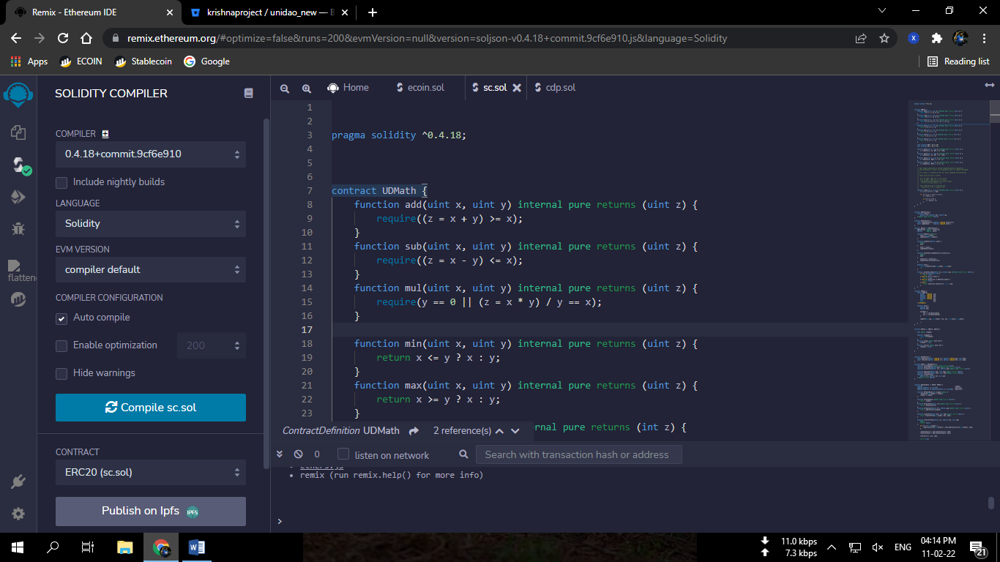
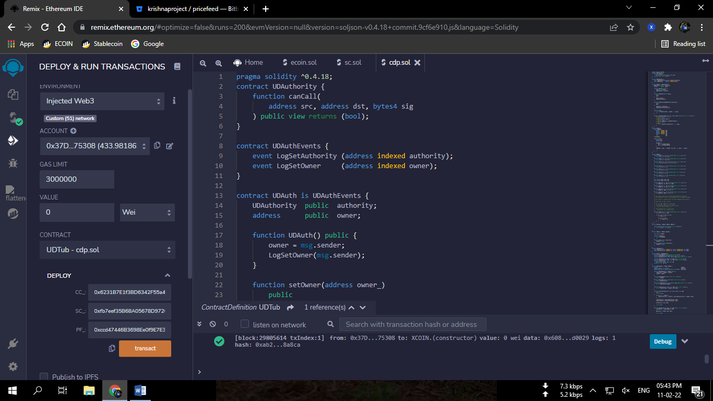
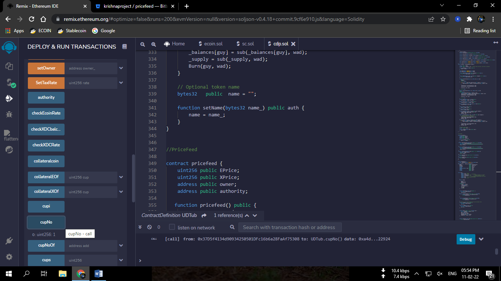
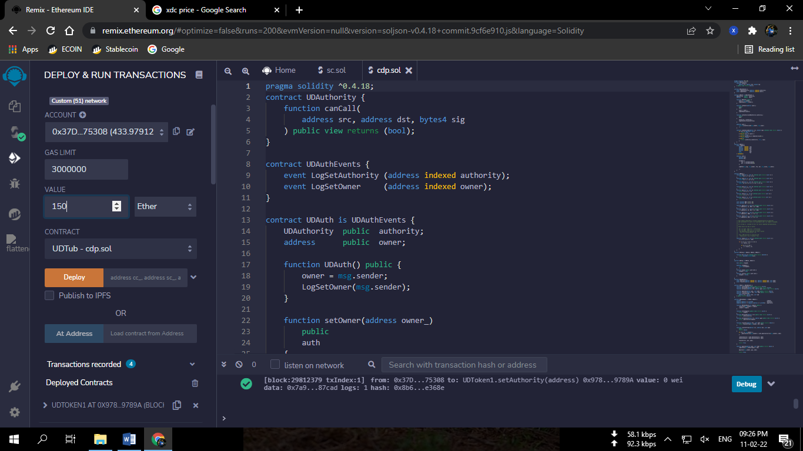
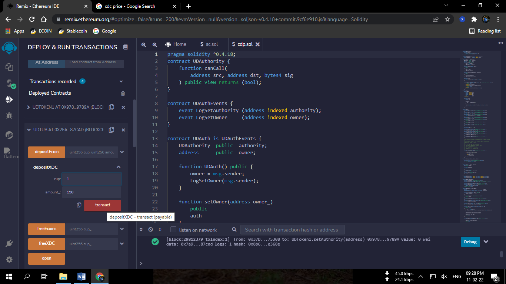
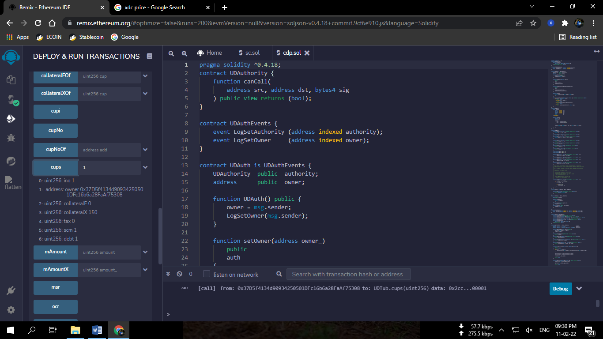

-   **Step 1**

Compile Stable Coin token smart contract (SC.sol) using Remix IDE with
solidity 0.4.18 compiler.

{width="6.289239938757655in"
height="3.535682414698163in"}

*Image 1 : Compiling of SC.sol file.*

-   **Step 2**

> After succesfull compiling the contract (SC.sol), now deploy the
> contract named as UDToken1 with constructor parameter token name
> ("XUSD").
>
> {width="5.770505249343832in"
> height="3.2440605861767278in"}
>
> *Image 2: Deployment of Stable coin token contract*

-   **Step 3**

> Now compile ECOIN.sol with solidity 0.4.24 compiler and deploy XCOIN
> (dummy ecoin) contract.
>
> This will mint 10 Billion supply of xcoin (dummy ecoin) to your
> wallet.
>
> We'll use this as collateral token.
>
> {width="6.5in"
> height="3.654166666666667in"}
>
> *Image 3: Compiling and deploying Ecoin.sol*

-   **Step 4**

> Now compile cdp.sol with solidity 0.4.18 compiler and deploy the
> contract UDTub.
>
> While deploying it will ask for 3 contract addresses

1.  CC\_ = Collateral coin address (The one we deployed in step 3)

2.  SC\_ = Stablecoin Address(The one we deployed in step 2)

3.  PF\_ = Pricefeed Address
    (0xccd47446B3698Ee0f9E7E331f5653a206696B179)

> (For more info of pricefeed visit
> <https://bitbucket.org/krishnaproject/pricefeed/src/master>)

Enter the following addresses carefully and deploy it.

{width="6.5in"
height="3.654166666666667in"}

*Image4: Deployment of CDP contract with the constructor parameters :
CC\_, SC\_, and PF\_.*

-   **Step 5**

> Now copy the deployed contract address of CDP and go to UDToken1
> (Stablecoin token) contract that you deployed in step 2 and set the
> copied address as authority using setAuthority Function.
>
> {width="6.5in"
> height="3.654166666666667in"}

-   **Step 6**

> Now go to the deployed XCOIN contract and approve some amount of Xcoin
> to the cdp address so that we can deposit Xcoin in the cdp.
>
> {width="6.5in"
> height="3.654166666666667in"}

*Image6: Approval of XCOINS to the cdp contract.*

*(Note: Please enter 10 Zeros after the value you want to approve for
decimals)*

-   **Step 7**

> Now go to the cdp contract.
>
> Open a vault using Open() function.
>
> Vault will be opened after you sign the transaction. You will get a
> vault number that you can check with the cupNo() function.
>
> {width="6.5in"
> height="3.654166666666667in"}
>
> *Image7:Opening of Vault.*
>
> {width="6.5in"
> height="3.654166666666667in"}
>
> *Image8: Check Cup (vault) number.*

-   **Step 8**

> Now we'll deposit ecoins (xcoin) and mint stablecoin using the
> depositEcoin function.
>
> Go to the deposit Ecoin function and enter your cup no.(from step7)
> and the amount of ecoins you want to deposit. (amount should be with
> zero decimals.)
>
> {width="6.5in"
> height="3.654166666666667in"}
>
> *Image9: Depositing 100000 (1 Lac) Ecoins in the vault 1.*
>
> Wait for the transaction to get completed.
>
> Stable coins will be minted with over collaterization ratio of 500%
> and latest price of ecoin.

-   **Step 9**

> Add stablecoin token(decimal 18) in your xdc wallet with the UDToken1
> contract address (step 2) and check your balance.

{width="6.5in"
height="3.654166666666667in"}

*Image10: XUSD Stablecoin balance in XDC wallet*

-   **Step 10**

> Now you can check the details of your vault using the cups function.
>
> Enter the number of your cup in the cups function and call.
>
> {width="6.5in"
> height="3.654166666666667in"}
>
> *Image11: Vault Details check.*
>
> *Ino is index number*
>
> *collateralE is Ecoin Collateral amount*
>
> *collateralX is XDC collateral amount*
>
> *tax is tax*
>
> *scm is total stablecoin minted*
>
> *debt is current debt*
