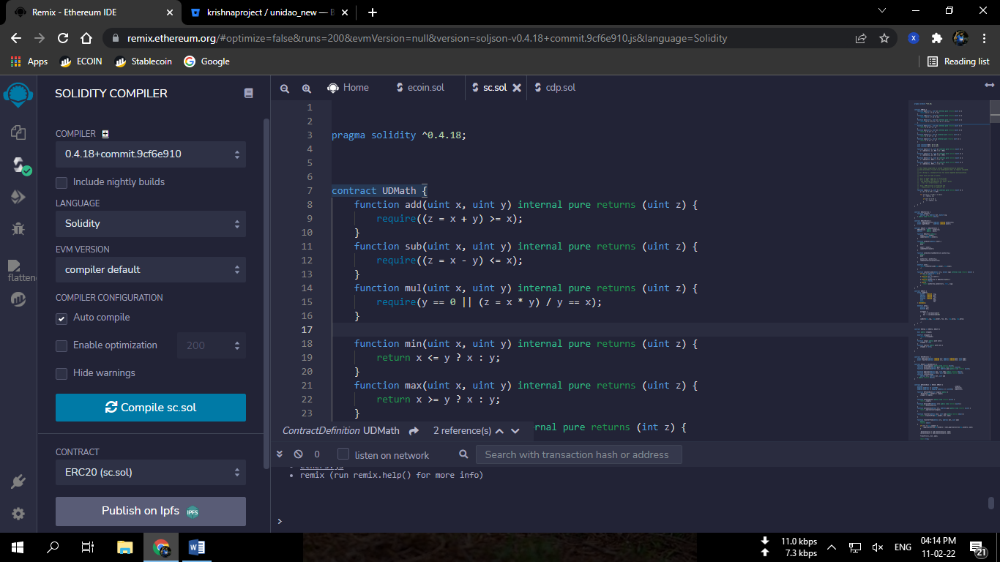
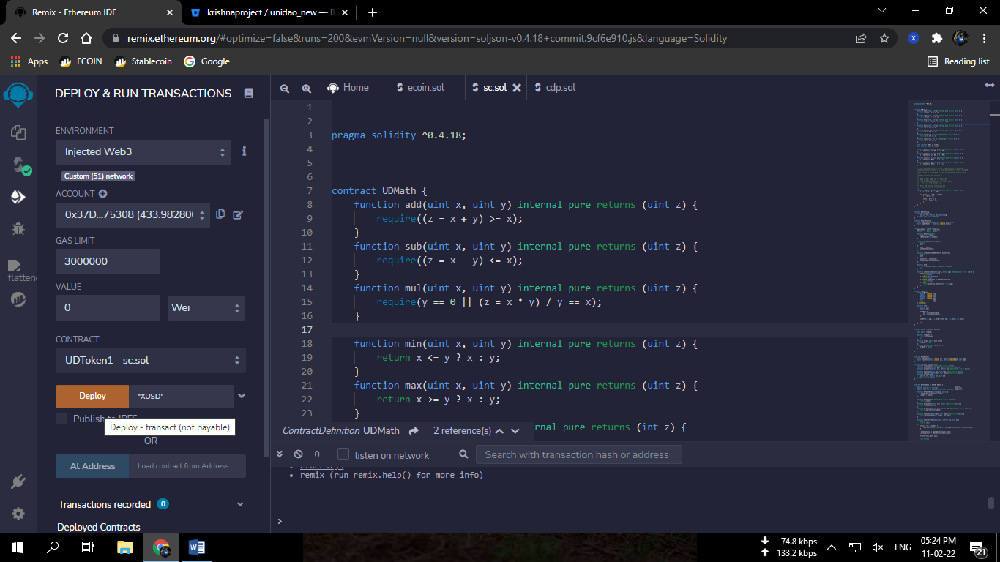
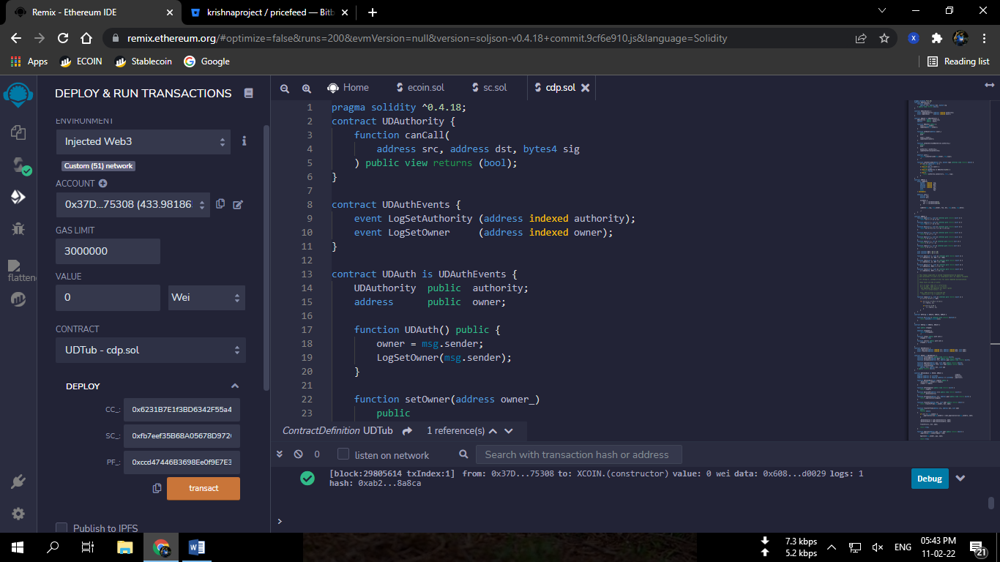
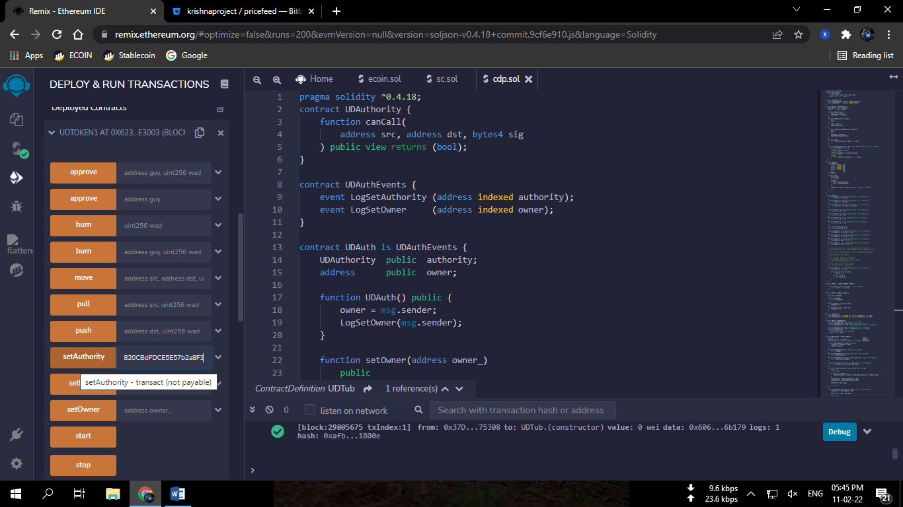
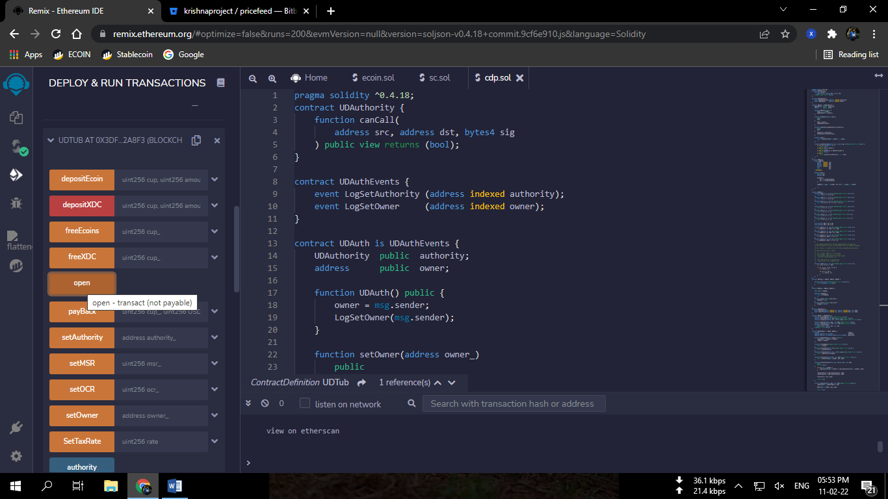
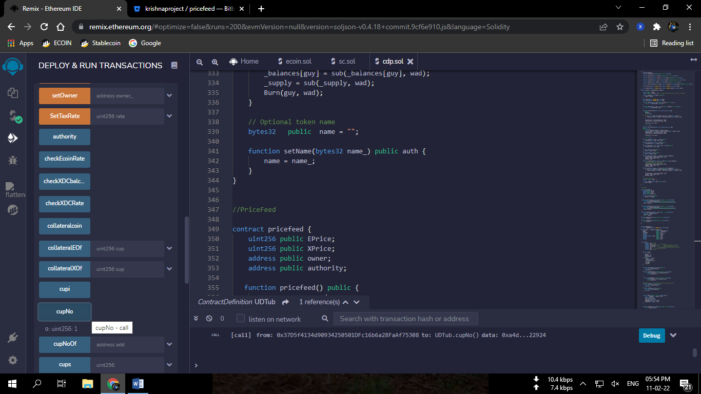
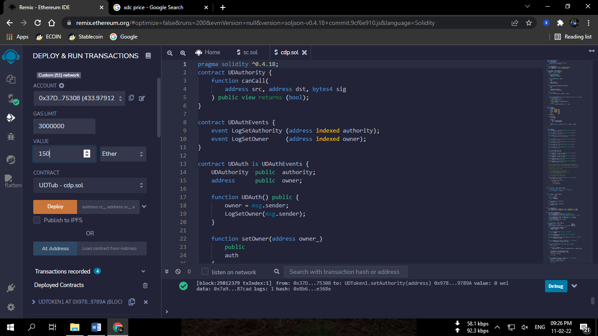
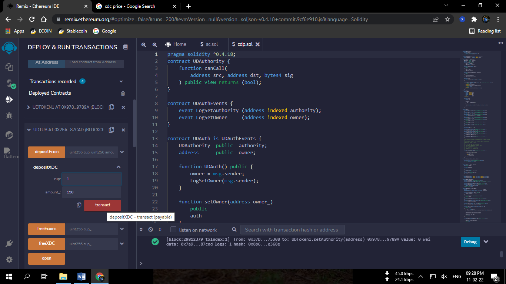
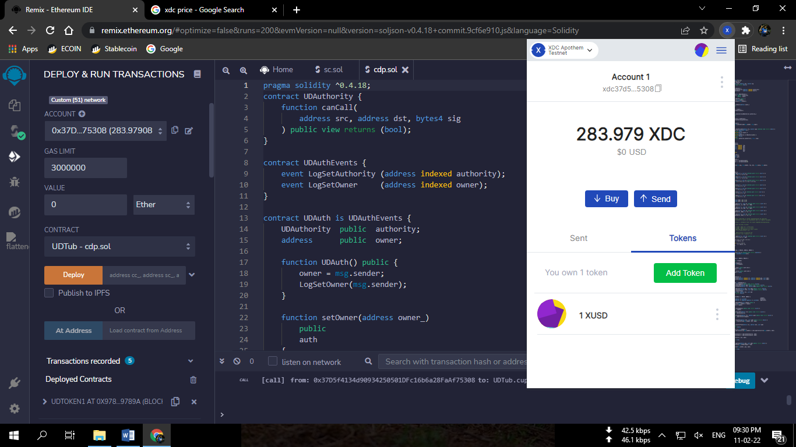
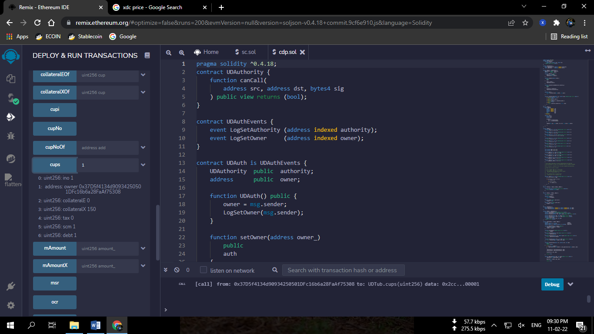

##### Note: For quicker and accurate interaction with the cdp, the asked input of amounts are required without decimals. The functions automatically add required decimals to the value.
## Latest Testnet Deployments.

### PriceFeed xdcccd47446B3698Ee0f9E7E331f5653a206696B179
### XUSD xdc3956213A969F0c561071BC2fCC64D025B13d301c
### CDP xdc883CA921fcAa2878d9266e2B11bcb4a31E122824

# Steps to deploy the current work
-   **Step 1**

Compile Stable Coin token smart contract (SC.sol) using Remix IDE with
solidity 0.4.18 compiler.

{width="6.289239938757655in"
height="3.535682414698163in"}

*Image 1 : Compiling of SC.sol file.*

-   **Step 2**

> After successful compiling the contract (SC.sol), now deploy the
> contract named as UDToken1 with constructor parameter token name
> ("XUSD").
>
> {width="5.770505249343832in"
> height="3.2440605861767278in"}
>
> *Image 2: Deployment of Stable coin token contract*

-   **Step 3**

> Now compile cdp.sol with solidity 0.4.18 compiler and deploy the
> contract UDTub.
>
> While deploying it will ask for 3 contract addresses

1.  CC\_ = Collateral coin address (XRC20 ECOIN)

2.  SC\_ = Stablecoin Address(The one we deployed in step 2)

3.  PF\_ = Pricefeed Address
    (0xccd47446B3698Ee0f9E7E331f5653a206696B179)

> (For more info of pricefeed visit
> <https://bitbucket.org/krishnaproject/pricefeed/src/master>)

Enter the following addresses carefully and deploy it.

{width="6.5in"
height="3.654166666666667in"}

*Image3: Deployment of CDP contract with the constructor parameters :
CC\_, SC\_, and PF\_.*

-   **Step 4**

> Now copy the deployed contract address of CDP and go to UDToken1
> (Stablecoin token) contract that you deployed in step 2 and set the
> copied address as authority using setAuthority Function.
>
> {width="6.5in"
> height="3.654166666666667in"}

-   **Step 5**

> Now go to the cdp contract.
>
> Open a vault using Open() function.
>
> Vault will be opened after you sign the transaction. You will get a
> vault number that you can check with the cupNo() function.
>
> {width="6.178803587051618in"
> height="3.473596894138233in"}*Image:Opening of Vault.*
>
> {width="6.5in"
> height="3.654166666666667in"}
>
> *Image: Check Cup (vault) number.*

-   **Step 6**

> Now we'll deposit xdc and mint stablecoin using the depositXDC
> function.
>
> Enter your cup number (from step 5) and amount of xdc you want to
> deposit.
>
> Enter the same amount of XDC by scrolling up in the value input of the
> transaction.
>
> {width="6.5in"
> height="3.654166666666667in"}
>
> *Image: Setting value of the transaction.*
>
> {width="6.5in"
> height="3.654166666666667in"}
>
> Image: Calling the depositXDC function with your cup number and the
> amount of xdc. XDC amount you write should be same as the amount you
> set in the *value* above.
>
> (xdc amount should be with zero decimals.)

-   **Step 7**

> Add stablecoin token(decimal 18) in your xdc wallet with the UDToken1
> contract address (step 2) and check your balance.

{width="6.5in"
height="3.654166666666667in"}

*Image10: XUSD Stablecoin balance in XDC wallet*

-   **Step 8**

> Now you can check the details of your vault using the cups function.
>
> Enter the number of your cup in the cups function and call.
>
> {width="6.5in"
> height="3.654166666666667in"}
>
> *Image11: Vault Details check.*
>
> *Ino is index number*
>
> *collateralE is Ecoin Collateral amount*
>
> *collateralX is XDC collateral amount*
>
> *tax is tax*
>
> *scm is total stablecoin minted*
>
> *debt is current debt*
